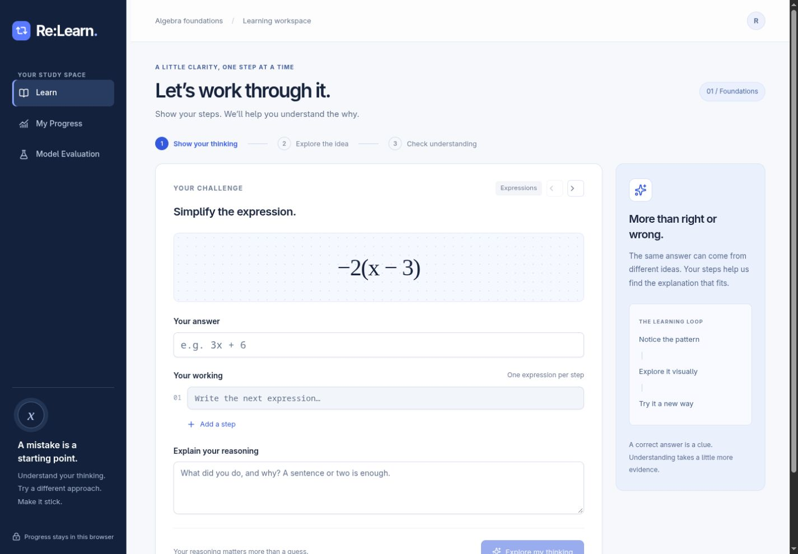

# Re:Learn — Adaptive Algebra Tutor

Hackathon repository: **StackUnderflow_maharashtra_round**.

**[Open the live demo](https://relearn-algebra-lab.sohamborhade93.chatgpt.site)** · [Demo script](docs/DEMO.md) · [Model report](docs/MODEL_CARD.md) · [Verification](docs/QA.md) · [Submission checklist](docs/HACKATHON.md)



Two learners can give the same wrong algebra answer for different reasons. Re:Learn uses their typed steps and explanations to suggest different misconceptions, selects a visual lesson, and checks the idea in three new ways.

“Multimodal” in this prototype means text, equations and interactive visual teaching. Model training ran locally; inference and learner progress run in each visitor’s browser. No paid AI API is required.


A static React/TypeScript algebra tutor with a real CPU-trained logistic-regression diagnosis model, six interactive interventions, three-part reassessment, and browser-local progress.

## Run the app

Validated with Node.js 26.10.0 and npm. The Sites starter requires Node >=22.13; the TypeScript test commands require a Node version supporting native type stripping (22.18+ recommended).

```sh
npm ci
npm run dev
```

Open the Local URL printed by the server (normally http://127.0.0.1:5173/).

```sh
npm run typecheck
npm test
npm run evaluate:challenge
npm run build
npm start
```

The build exports `out/`; `npm start` serves it at http://127.0.0.1:4173/. Any static HTTPS host can serve that directory. The development server and static export need localhost binding permission. No AI API key, runtime Python backend, GPU, account, or remote learner database is needed.

## Reproduce the model

Validated with Python 3.14. Create an isolated environment and install the exact recorded dependencies:

```sh
python3 -m venv .venv
.venv/bin/pip install -r ml/requirements.txt
.venv/bin/python ml/train.py
npm test
npm run evaluate:challenge
```

Training is deterministic (seed 42). It generates 700 labelled synthetic examples, splits entire structural/reasoning families, fits word/character TF-IDF and multinomial logistic regression, evaluates an answer-only baseline, and exports all vocabulary, IDF, coefficients, intercepts, thresholds and provenance. The browser implements the same sparse TF-IDF/softmax pipeline. The 35 Python/JavaScript parity fixtures are tested to an absolute tolerance of 1e-8.

`public/model/classifier.json` is the actual trained model, not a mock endpoint. `metrics.json` and `challenge-results.json` are measured outputs. Rebuild the site after retraining; reload an existing browser session to load the new model.

## Source map

- `app/` and `components/relearn/`: learning workspace, interactive activities, assessment, progress and model-evaluation views.
- `lib/relearn/`: restricted linear-algebra parser, trained-model inference, curriculum, assessment rules, IndexedDB persistence and learner history.
- `ml/train.py`, `ml/data/`: synthetic generation, train/validation/test splits, source audit, challenge data and attribution.
- `tests/`: meaningful behavioral tests, model parity fixtures, developmental challenge evaluation and independent SymPy assessment-key checks.
- `docs/DEMO.md`, `public/pilot-kit.md`, `docs/MODEL_CARD.md`: demo script, pending peer-pilot protocol and limitations.

## How the tutor works

An attempt includes the problem, answer, ordered working and learner explanation. The classifier ranks seven classes (six misconceptions plus consistent reasoning). The independent algebra checker locates the first invalid step. Missing, contradictory, guessed or low-score evidence triggers up to two follow-up questions; remaining uncertainty is explicit. A likely label selects its authored lesson.

Each assessment requires a new problem, a chosen explanation plus corrected expression, and a different representation. All three must pass without assistance. Final answers must be simplified or solved—not merely an unchanged equivalent question. Assisted or incomplete checks cannot establish understanding. A passing personal check schedules an in-app retention check at least 24 hours later; no external reminders are sent. Subsequent mistakes can reopen the skill. Demonstration sessions are explicitly excluded from personal progress.

## Privacy and scope

Learner responses remain in IndexedDB in that browser. There are no analytics or outbound learner-data calls. Export is a user-initiated local JSON download. No cross-device sync is provided. Clearing site data removes progress. If storage is unavailable, the app warns and preserves current input in memory with an export option.

The parser accepts linear expressions and equations in x, ordinary numbers, +, −, *, / and parentheses; it does not execute user text. Powers, other variables and variable denominators are outside this prototype. Model failure produces a visible unavailable state.

## Honest evaluation status

The 700 training/evaluation rows are generated from agent-authored templates. The source benchmark informed taxonomy but no source teacher explanation was used as learner input. The 34-case challenge set was used in development and is NOT an untouched independent benchmark. Human review, the 3–5 person peer pilot and genuine delayed retention observations are pending. See the model card for measured failures as well as successes.

## Attribution

MaE: Math Misconceptions and Errors Dataset by Nancy Otero, Stefania Druga and Andrew Lan, https://github.com/nancyotero-projects/math-misconceptions, associated with https://arxiv.org/abs/2412.03765. The source repository is MIT-licensed; its notice is retained in `ml/data/MAE-LICENSE`. The source snapshot is retained for audit only. A source reference answer for 5^-2 was incorrect (0.05 instead of 0.04) and was excluded. Re:Learn does not imply endorsement by the authors.

The interface uses the bundled Sites/Vinext starter and its dependencies under their respective licences. The prepared source can be built independently; `.openai/hosting.json` binds the current owner's Site and should not be reused when creating someone else's Site.
